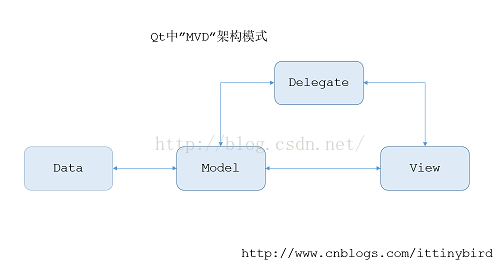
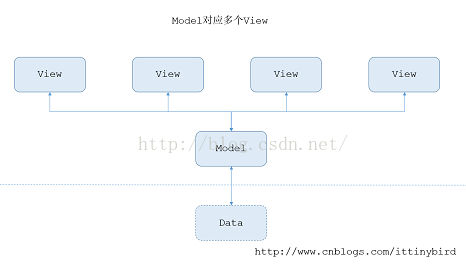
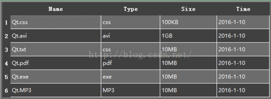

# MVD模式与concurrent    

## 1 MVD模式   
MVC全称是 Model View Controller，是一种非常非常流行的架构模式，相关MVC具体的，网上已经非常非常详尽了，不赘述了。   

Qt中的MVC并不叫MVC，而是叫“MVD”，Qt中没有Controller的说法，而是使用了另外一种抽象: Delegate (委托) ，其行为和传统的MVC是相同的。写过C#的同学肯定对delegate就不陌生了，这里delegate的用法就是**负责协调Model和View之间的数据**。其思想如下图所示     

   

Model是唯一和数据集打交道的组件，View不接触数据源，其所需要的数据可以从Model中取出，而Delegate正式负责协调Model和View上数据。这种将view和数据源隔离的方式有几点好处：   
1. 在处理较大的数据集时每个组件各司其职，不至于降低性能。  
2. 一个Model可以映射到多个View，这样可以以不同的方式查看数据同一份数据。  
3. 如果底层数据源的存储改变了，我们只需要处理Model就可以了。  

   

假设如图所示的Data代表一个学校的期末成绩的数据源，Model获取了其中计算机学院的所有学生的成绩，而软件的界面上我们有多个View用于显示不同专业学生成绩的详细，我们只需要从Model中筛选出所需的数据，而**筛选的工作正是交给Delegate**来做的。      

Qt为我们预定义了丰富组件类，通常情况下使用这些类就能实现比较好看的视图了。这个例子里我们正式使用QTableView和QStandardItemModel，Delegate在这里不需要关注，默认的Delegate就可以很好的协调Model和View了。 考虑篇幅，我做一个比较小的视图，就不考虑外部的数据源了，数据都是我手动添加的 ,在一个Widget类中我们分别定义一个QTableView和一个QStandardItemModel，其结构大致是这样的：     

```C++
class demo : public QWidget
{
  Q_OBJECT
 
public:
  demo(QWidget *parent = 0);
  ~demo();
 
private:
  Ui::demoClass ui;
  QStandardItemModel* mModel;
};
```

ui成员是Qt Designer生成的类，我们的QTableView的对象就在其中（QTableView我直接拖拽上去的，为了节约时间，呵呵），之后再demo的构造函数中我们使用setModel函数就可以把Model和view进行绑定：    

```c++
demo::demo(QWidget *parent)
: QWidget(parent), mModel(new QStandardItemModel())
{
  ui.setupUi(this);
  mModel->setHorizontalHeaderItem(0, new QStandardItem(QObject::tr("Name")));
  mModel->setHorizontalHeaderItem(1, new QStandardItem(QObject::tr("Type")));
  mModel->setHorizontalHeaderItem(2, new QStandardItem(QObject::tr("Size")));
  mModel->setHorizontalHeaderItem(3, new QStandardItem(QObject::tr("Time")));
  
  QList<QStandardItem *> item;
  item.append(new QStandardItem(QObject::tr("Qt.css")));
  item.append(new QStandardItem(QObject::tr("css")));
  item.append(new QStandardItem(QObject::tr("100KB")));
  item.append(new QStandardItem(QObject::tr("2016-1-10")));
  mModel->appendRow(item);
    ......
  ui.mView->setModel(mModel);
}
```

一些重复的添加数据的工作，我就没有贴出来，这段代码基本上没有接触过Qt的人也能很好的理解，很直观是吧。首先在mModel中设置后表头然后添加数据，到最后调用setModel()函数绑定M/V，之后Delegate就默默地后台工作，帮我们完成View的绘制，其效果图：   

    

当然界面我用qss做了一些美化的工作，感兴趣的朋友可以点击 这里 下载到这个demo的源码。


也许上述的例子已经能满足你的日常需要，但是仍有瑕疵，一个“炫酷”的界面应该具备以下几点 比如     

1. Name列 要能显示文件类型的ICON ;    

2. 日期编辑的时候不是允许输入任意字符，当然你可以使用正则表达式过滤输入，但是这仍然不够完美，合理的方法应该是使用一个日历的组件去编辑Time列。

3. [进阶版](https://www.cnblogs.com/Braveliu/p/7488250.html)  


## 2 参考资料   
1. https://blog.csdn.net/rl529014/article/details/52072380    
2. https://blog.csdn.net/rl529014/article/details/52072380   
3. https://blog.csdn.net/u012521552/article/details/51771318?utm_medium=distribute.pc_relevant.none-task-blog-searchFromBaidu-2.control&depth_1-utm_source=distribute.pc_relevant.none-task-blog-searchFromBaidu-2.control   
4. https://blog.csdn.net/zhx6044/article/details/9009117?utm_medium=distribute.pc_relevant.none-task-blog-searchFromBaidu-1.control&depth_1-utm_source=distribute.pc_relevant.none-task-blog-searchFromBaidu-1.control   
5. https://www.cnblogs.com/Braveliu/p/7488250.html   
