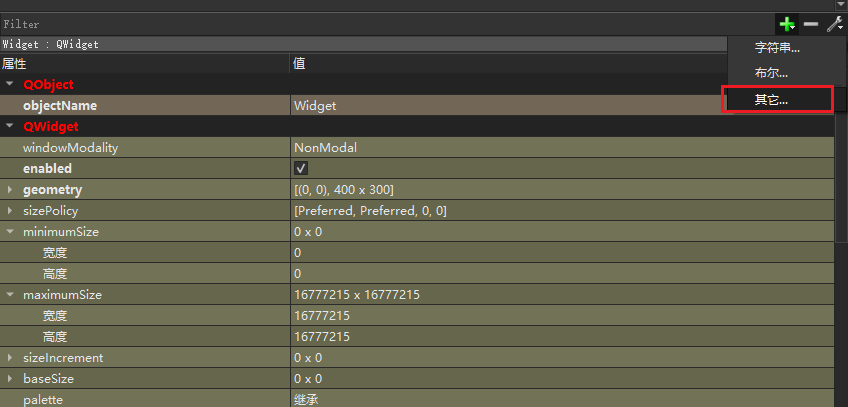

# qt中的Q_PROPERTY属性用法   

## 概述  
在wayland中，在类定义的起始位置经常看到Q_PROPERTY定义各种变量，以及变量的读取和写入操作，如何使用Q_PROPERTY，以及使用Q_PROPERTY的好处是什么？下面开始进行阐述。

## 基本用法  

Q_PROPERTY()是一个宏，用来在一个类中声明一个属性property，由于该宏是qt特有的，需要用moc进行编译，故必须继承于QObject类。

```C++
Q_PROPERTY(double minValue READ getMinValue WRITE setMinValue)
Q_PROPERTY(bool animation READ getAnimation WRITE setAnimation)
Q_PROPERTY(QColor barColor READ getBarColor WRITE setBarColor)
```

- 一个属性的行为就像类的数据成员，但是它还具有附加的特性，这些特性可以被元数据对象系统操作。这些特性是：
  需要一个READ访问器函数。用于读属性的值。理想情况下，有一个不变的函数用于此目的，并且它必须返回属性的类型的值或指针或引用。例如，QWidget::focus是一个只读的属性，它对应一个读函数：QWidget::hasFocus()。

-  一个可选的WRITE访问器函数。它用于设置属性的值。它必须返回空并且至少具有一个参数，参数是属性类型的值或指针或引用。例如：QWidget::enabled具有WRITE函数QWidget::setEnable()。只读属性不需要写函数。例如，QWidget::focus没有对应的写函数。

- 一个可选的RESET函数。用于设置属性的值到它的默认值。例如：QWidget::cursor具有典型的READ和WRITE函数，QWidget::cursor()和QWidget::setCursor()，并且它也具有一个RESET函数，QWidget::unsetCursor()。RESET函数必须返回void并且不带有任何参数。
  一个可选的NOTIFY信号。如果被定义了，信号将在属性的值改变时发出。信号必须带有一个参数，这个参数的类型必须与属性相同；参数保存的是属性的新值。

- 一个DESIGNABLE变量表明此属性是否在界面设计器的属性编辑器中出现。大多数属性是可见的，除了为这个变量传入true或false，你还可以指定一个bool型的成员函数。
  SCRIPTABLE变量表明这个属性是否可以被一个脚本引擎操作（默认是true）。你也可以赋予它true或false或bool型函数。

- STORED变量表明了属性是否被认为是独立存在还是依赖于其它的值而存在。它也表明是否在保存对象状态时保存此属性的值。大多数属性都是需要保存的，但是，如QWidget::minimumWidth()就是不被保存的，因为它的值是从另一个属性QWidget::minimumSize()得来的。

- USER变量表明属性是否被设计为面向用户的或用户可修改的类属性。通常，每个类只有一个USER属性。例如，QAbstractButton::checked是按钮类的用户可修改属性。注意QItemDelegate获取和设置widget的USER属性。

- CONSTANT的出现表明属性的值是不变的。对于一个object实例，常量属性的READ方法在每次被调用时必须返回相同的值。此常量值可能在不同的object实例中不相同。一个常量属性不能具有WRITE方法或NOYIFY信号。

- FINAL变量的出现表明属性不能被派生类所重写。有些情况下，这可以用于效率优化，但不是被moc强制的。程序员必须永远注意不能重写一个FINAL属性。

READ，WRITE和RESET函数都可以被继承。它们也可以是虚函数。当它们在被多重继承中被继承时，它们必须出现在第一个被继承的类中。属性的类型可以是被QVariant支持的所有类型，也可以是用户定义的类型。在下面的例子中，类QDate被当作用户自定义类型。  

## 具体例子  

```C++
// **.h
class Widget : public QWidget
{
    Q_OBJECT
    Q_PROPERTY(bool enabled READ getEnabled WRITE setEnabled)
    Q_PROPERTY(double minValue READ getMinValue WRITE setMinValue)

public:
    explicit Widget(QWidget *parent = nullptr);
    ~Widget();
    void setEnabled(bool e) { m_bl_enabled = e; }
    bool getEnabled() const { return m_bl_enabled; }
    double getMinValue() const;
    void setMinValue(double minValue);
public slots:
  //  void setRange(double minValue, double maxValue);

private:
    Ui::Widget *ui;
    double minValue;
    bool m_bl_enabled = false;
};
```

```C++
// *.cpp
Widget::Widget(QWidget *parent) :
    QWidget(parent),
    ui(new Ui::Widget)
{
    ui->setupUi(this);

    minValue = 0;

}

double Widget::getMinValue() const
{
    return this->minValue;
}

void Widget::setMinValue(double minValue)
{
    this->minValue = minValue;
    update();
}


Widget::~Widget()
{
    delete ui;
}
```

```C++
// main.cpp

int main(int argc, char *argv[])
{
    QApplication a(argc, argv);
    Widget w;
    qDebug() << w.getEnabled();
    w.setProperty("enabled", true);
    qDebug() << w.getEnabled();
    w.show();
    return a.exec();
}
```

## 添加属性   

1. 可以在属性的框中点 +  ，可以添加相应的属性，如下所示，

   

2. 设置属性的值，和类型  

  


## 扩展资料   

1. QML中也经常用Q_PROPERTY来实现C++数据和JS数据的之间的交互   
1. QSS中也会经常用到，实现不同的界面 风格设置    


## 参考资料   

1. https://blog.csdn.net/libaineu2004/article/details/88106976?utm_medium=distribute.pc_relevant.none-task-blog-baidujs_baidulandingword-0&spm=1001.2101.3001.4242      
2. https://blog.csdn.net/weixin_34383618/article/details/90524917?utm_medium=distribute.pc_relevant_t0.none-task-blog-2%7Edefault%7EBlogCommendFromMachineLearnPai2%7Edefault-1.vipsorttest&depth_1-utm_source=distribute.pc_relevant_t0.none-task-blog-2%7Edefault%7EBlogCommendFromMachineLearnPai2%7Edefault-1.vipsorttest     
3. https://libaineu2004.blog.csdn.net/article/details/88106845  