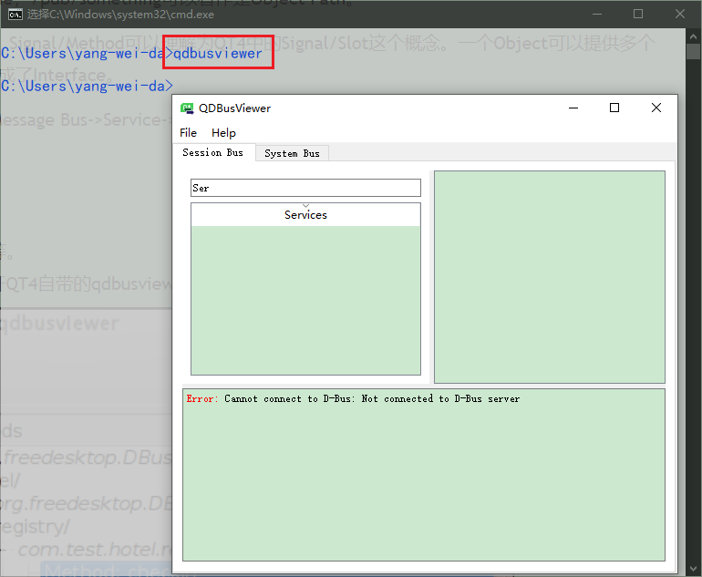

# qt实现dbus信号    

## 概述   

在使用kwin/wayland过程中，wayland_server和应用软件进行交互的过程中，是借助于C/S的软件架构，但是进行信号之前的通信时，使用的d-bus信号的方式。那么，什么而是d-bus，用d-bus通信有哪些好处？下面进行阐述。

## d-bus简介  

D-Bus是一种进程间通信的机制，它被设计成为一种低开销、低延迟的IPC，并被多种桌面环境（如KDE、GNOME等）所采用。

关于D -Bus的详细介绍可以参考freedesktop.org提供的两份文档，  [D-Bus Tutorial ](http://dbus.freedesktop.org/doc/dbus-tutorial.html) 和  [D-Bus Specification](http://dbus.freedesktop.org/doc/dbus-specification.html) 。

>##### 基本概念  
>
>D -Bus提供了多种Message Bus用于应用程序之间的通信。通常，Linux发行版都会提供两种Message Bus：System Bus和Session Bus。System Bus 主要用于内核和一些系统全局的service之间通信；Session Bus 主要用于桌面应用程序之间的通信。
>
>D-Bus中用于通信的基本单元叫做Message，Message的具体格式可以参考   [D-Bus Specification](http://dbus.freedesktop.org/doc/dbus-specification.html)。
>
>当应用程序连接到Message Bus上时，D-Bus会分配一个unique connection name，这个unique name通常的格式如":34-907"。**Unique name以":"开头，后面的数字没有特别的意义，只是为了保证这个unique name的唯一性**。
>
>另外，应用程序还可以向Message Bus请求一个well-known name，格式如同一个反置的域名，例如"com.mycompany.myapp"。**当一个应用程序连接到Message Bus上时，可以拥有两种名称：unique connection name和well-known name**。这两种名称的关系可以理解为网络上的IP地址和域名的关系。
>
>在D-Bus规范里，unique connection name和well-known name都叫做Bus Name。这点比较奇怪，也比较拗口，Bus Name并不是Message Bus的名称，而是应用程序和Message Bus之间的连接的名称。
>
>应用程序和Message Bus之间的连接也被称为Service，这样一来，把Bus Name称作Service Name在概念上会更清晰一点。
>
>当应用程序连接到Message Bus上时，该应用程序可以在Bus上创建一到多个Object（我们可以把D-Bus的object理解成面向对象语言里的object）。Service通过Object 为其他应用程序提供访问接口。因为在Message Bus上，**一个应用程序可以对应多个Object，所以不同的Object必须由Object Path（类似于文件系统的路径）来区分**。Object Path的格式如"/foo/bar"。
>
>Serivce和Object Path之间相互独立,没有任何关联,注册时可以根据需要命名。

## D-Bus调试工具 

常用的D-Bus调试工具有D-Feet、qdbusviewer等。

>##### qdbusviewer的安装  
>
>```shell
>sudo apt-get install qt4-qmlviewer 
>sudo apt install qt4-dev-tools
>```
>
>在Console窗口中键入qdbusviewer命令可以打开QT4自带的qdbusviewer。     

    

## D-Bus与Qt   
本文以一个实作为例，介绍D-Bus在QT4下的绑定。在实作中，我们会在Session Bus上注册一个Hotel Service，通过这个Service，可以实现check in，check out以及query的动作。  

> ##### Qt API 
>
> 自版本4.2起，已随Qt分发了libdbus QtDBus的Qt绑定。有关如何使用QtDBus的详细信息，请参见 [Qt文档](http://qt-project.org/doc/qt-5/qtdbus-index.html)。 


## 参考资料 
1. https://blog.csdn.net/FoxBryant/article/details/53996945      
2. https://www.cnblogs.com/wwang/archive/2010/10/27/1862552.html   
3. https://www.morfans.cn/archives/2448  
4. https://doc.qt.io/qt-5/qtdbus-index.html    
5. https://blog.csdn.net/imxiangzi/article/details/49699529/?utm_medium=distribute.pc_relevant_download.none-task-blog-baidujs-1.nonecase&depth_1-utm_source=distribute.pc_relevant_download.none-task-blog-baidujs-1.nonecase   